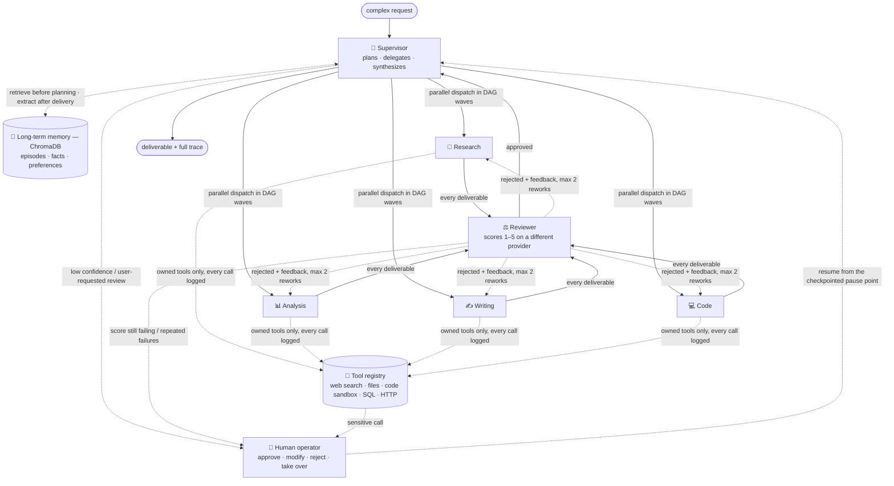
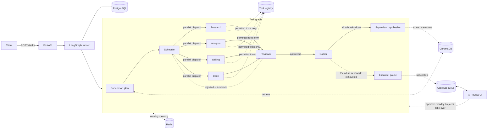

# Agent Orchestration System



I built a multi-agent orchestration system where AI agents decompose complex tasks, use tools to execute them, learn from past interactions via persistent memory, and escalate to humans when confidence is low. It's not an AI demo — it's production infrastructure for autonomous AI workflows: durable pause/resume, per-decision tracing with dollar costs, deterministic replay, and a human approval queue are part of the core design, not bolt-ons.

## The five pillars

| Pillar | What's implemented | Where |
|---|---|---|
| **Multi-agent orchestration** | Supervisor → 4 specialists → independent reviewer, wired as a LangGraph state machine with parallel DAG-wave dispatch, retry and rework-with-feedback edges, and Postgres checkpointing | [`graph/`](src/orchestrator/graph), [`agents/`](src/orchestrator/agents), [`planning/`](src/orchestrator/planning) |
| **Tool use** | 5 tools behind a registry enforcing per-specialist permissions, rate limits, and sensitive flags; every invocation logged with arguments, output, latency, status | [`tools/`](src/orchestrator/tools) |
| **Memory** | Task-scoped working memory (Redis) + long-term semantic memory (ChromaDB) with retrieval into planning, importance scoring, consolidation, expiration, and a right-to-forget endpoint | [`memory/`](src/orchestrator/memory) |
| **Human-in-the-loop** | 5 escalation triggers → 4 approval levels; durable pause via graph interrupts; review UI with full decision context, four resolution actions, and a grounded chat panel | [`hitl/`](src/orchestrator/hitl), [`ui/review_app.py`](ui/review_app.py) |
| **Observability** | Every decision is an OpenTelemetry span exported to Postgres; trace explorer with expandable prompts; cost tracking per task + aggregates; deterministic replay and fork-at-step-k | [`observability/`](src/orchestrator/observability), [`ui/trace_explorer.py`](ui/trace_explorer.py) |

## Quickstart

```bash
git clone https://github.com/AlirezaAbedinii/agent-orchestration-system && cd agent-orchestration-system
cp .env.example .env              # add API keys — or set MOCK_LLM=1 for a keyless run
docker compose up -d --build      # full stack; migrations + demo seed run automatically
make demo                         # showcase scenario — pauses once for your approval
```

The stack runs **key-free** under `MOCK_LLM=1`: recorded LLM fixtures ship inside the images and play through the production code path, so everything below — Celery execution, HITL pauses, tracing, the demo — works without spending a cent. Real providers are one `.env` edit away.

| Service | Host port | Role |
|---|---|---|
| `api` | 8080 | FastAPI orchestration API |
| `worker` | — | Celery worker + beat (`RUN_MODE=celery`), runs the graphs |
| `postgres` | 5432 | tasks, plans, approvals, spans, checkpoints |
| `redis` | 6379 | working memory + Celery broker |
| `chromadb` | 8010 → 8000 | long-term semantic memory |
| `review-ui` | 8511 → 8501 | human approval queue + memory dashboard |
| `trace-explorer` | 8512 → 8502 | traces, costs, replay |

Two one-shot helpers run at startup and exit: `migrate` (Alembic upgrade + demo-schema seed, gating `api`/`worker`) and `sandbox` (builds the no-network image that `code_exec` runs snippets in). Host ports that commonly collide (8000, 8501) are remapped.

## Demo

<!-- Demo recording (<5 min): docs/demo.gif — capture per the shot list in docs/architecture.md -->
> 🎬 **Demo recording:** coming with the final polish pass (`docs/demo.gif`). The scripted scenario below is exactly what it shows.

`make demo` ([scripts/run_demo.py](scripts/run_demo.py)) drives the showcase end-to-end over the API:

1. **Seeds long-term memory** by running a prior vector-database comparison task to completion — so step 2's planning is visibly memory-informed.
2. **Submits the showcase task** — *"Research the top 3 open-source vector databases (Chroma, Qdrant, Weaviate), extract and compare their GitHub statistics, analyze the trade-offs, and produce a one-page recommendation memo with cited sources"* — with human review requested.
3. **Narrates the run live**: three research specialists fan out in parallel (one per candidate), the analysis specialist pulls GitHub stats via SQL and computes the comparison in the code sandbox, and the reviewer rejects the first memo draft for missing citations before the reworked draft passes.
4. **Pauses once for you**: approve the final memo in the review UI on :8511 (or pass `--auto-approve` for an unattended run).
5. **Closes with the receipts**: the delivered memo, execution waves, reviewer verdicts, memory retrievals and write-backs, escalations with human review time, and the dollar cost — plus links into the trace explorer.

```
execution waves (parallel fan-out within a wave):
  wave 1: r1, r2, r3  ⇉ parallel fan-out
  wave 2: a1          wave 3: w1          wave 4: w1
reviewer verdicts:
  w1: 2 → 5/5   rejected: Missing citations: every claim in the memo must cite a source URL…
memory retrieval at planning: 9 memories injected · write-back: 4 new memories
escalations: plan → approve (0.9s) · final → approve (14.4s human review)
cost: $0.014591 — 21 LLM calls, 8160+1715 tokens, 6 tool calls
```

`scripts/record_fixtures.py` is the companion tool: it runs any request against the live providers and captures every LLM response as an exact-match fixture, which is how the deterministic `MOCK_LLM=1` corpus was built.

## Screenshots

<!-- Capture from a `make demo` run and drop into docs/screenshots/, then uncomment: -->
<!--  -->
<!--  -->
<!--  -->

| Screenshot (placeholder) | What it shows | Where to capture |
|---|---|---|
| `docs/screenshots/review-ui-decision.png` | The review queue at the demo's final-memo decision point: trigger badge, plan progress, proposed action with reasoning, relevant memories, the four action buttons, and the chat panel | `make demo`, then :8511 while it waits |
| `docs/screenshots/trace-explorer-tree.png` | The demo task's span tree — parallel research wave, the 2/5 review in yellow, escalations in orange — with one LLM span expanded to its exact prompt/response | :8512 → 🌳 Trace |
| `docs/screenshots/memory-dashboard.png` | Episodes/facts/preferences with importance and access counts, recent memory activity, and the right-to-forget button | :8511 → 🧠 Memory dashboard |

## Contents

- [How it works](#how-it-works)
- [Agent hierarchy](#agent-hierarchy)
- [Tool registry](#tool-registry)
- [Memory](#memory)
- [Human-in-the-loop](#human-in-the-loop)
- [Observability](#observability)
- [Tech stack](#tech-stack) · [Project status](#project-status)
- [Local development](#local-development) · [Usage](#usage) · [Testing](#testing)
- [Repository structure](#repository-structure)
- [Design decisions](#design-decisions)
- [Cost expectations](#cost-expectations)
- [Limitations & next steps](#limitations--next-steps)

Deep dive: [docs/architecture.md](docs/architecture.md) — full component/data-flow diagrams and the reasoning behind each design decision.

## How it works



1. **Intake** — a request comes in via `POST /tasks`; a task row is created and the graph runs (inline in-process for development, Celery-backed in the composed stack).
2. **Plan** — the supervisor first retrieves similar past episodes, domain facts, and user preferences from long-term memory and plans with them in context. It decomposes the request into subtasks with dependencies, assigns each to a specialist, and reports a confidence score. Plans are schema-validated (unique ids, resolvable dependencies, no cycles) and retried once if invalid.
3. **Schedule & execute** — independent subtasks run in parallel; each specialist works through a bounded tool-use loop, calling only the tools it owns. Outputs, intermediate results, and errors land in shared working memory as they happen.
4. **Review** — every deliverable is scored 1–5 by a reviewer running on a *different model provider* than the specialist that produced it, so a shared provider blind spot can't rubber-stamp its own output. Rejections go back to the specialist with feedback (up to 2 rework cycles).
5. **Escalate or synthesize** — low plan confidence, two failures on the same subtask, exhausted rework, a sensitive tool call, or a user-requested review pauses the run: the graph checkpoints, the full decision context lands in the approval queue, and the reviewer is notified. Execution resumes from the exact pause point with the human's decision. Otherwise the supervisor synthesizes the final deliverable from the completed subtasks.
6. **Remember** — the finished task is distilled (what was asked, what approach worked, tools used, facts discovered, preferences observed) into long-term memory, and the task's working memory is cleared. This is how the system gets better at repeated kinds of work.

## Agent hierarchy

| Agent | Role | Model |
|---|---|---|
| **Supervisor** | Decomposes the request into a plan; synthesizes the final deliverable | Strong model (`gpt-4o`) |
| **Research** | Web research, source gathering | Cheaper model (`gpt-4o-mini`) |
| **Analysis** | Data extraction and computation (SQL + code) | Cheaper model (`gpt-4o-mini`) |
| **Writing** | Drafts, summaries, memos | Cheaper model (`gpt-4o-mini`) |
| **Code** | Writes and runs code in the sandbox | Cheaper model (`gpt-4o-mini`) |
| **Reviewer** | Scores specialist output 1–5 with feedback before it returns to the supervisor | Different provider than the producer (`claude-sonnet-5` by default) |

Every agent is a typed LangGraph node — Pydantic models in, Pydantic models out — routed through a single provider-agnostic LLM client so swapping models is a config change, not a rewrite.

## Tool registry

| Tool | Purpose | Owners | Notes |
|---|---|---|---|
| `web_search` | Web search | research | Tavily if configured, DuckDuckGo fallback otherwise |
| `file_read` / `file_write` | Read/write within the task's workspace | analysis, writing, code | Path traversal outside the workspace is rejected |
| `code_exec` | Run a Python snippet | analysis, code | Sandboxed: no network, capped CPU/memory/pids/time |
| `db_query` | Read-only SQL | analysis | `SELECT`/`WITH` only, single statement, read-only transaction |
| `api_call` | Call an allowlisted HTTP API | research | `POST` is flagged sensitive |

Every tool call — successful, rejected, rate-limited, or failed — is logged with its arguments, output, latency, and status. Each tool has a per-task rate limit, and specialists can only invoke tools they're explicitly assigned.

## Memory

**Working memory (Redis)** is scoped to a single task: the current plan, each completed subtask's output, intermediate results, and an error log, shared by every agent working the task. It's cleared on completion and TTL-guarded against crashed runs.

**Long-term memory (ChromaDB)** persists across tasks in three collections — *episodes* (what was asked and which approach worked), *facts* (domain knowledge discovered), and *preferences* (what this user likes). After every completed task an extraction pass writes new memories; before every plan, the top matches are retrieved and injected into the supervisor's prompt, with each retrieved id recorded to an audit log.

Memories carry an importance score — `(1 + access_count) × exponential recency decay` — so what gets used stays relevant:

| Mechanism | What it does | When |
|---|---|---|
| Access bump | Retrieval increments access count and re-scores importance | Every planning retrieval |
| Consolidation | Clusters near-duplicates (cosine similarity) and merges each cluster into one LLM-written summary | Daily beat job / `POST /memory/maintenance/consolidate` |
| Expiration | Deletes memories that are both stale and below the importance floor | Daily beat job / `POST /memory/maintenance/expire` |
| Dashboard | Everything the system remembers about a user, plus recent memory activity | Review UI → 🧠 Memory dashboard, or `GET /memory/users/{id}` |
| Right to forget | Purges a user's long-term memories, working memory, and audit trail | Dashboard button, or `DELETE /memory/users/{id}` |

## Human-in-the-loop

Escalation is a first-class graph state, not an afterthought. Five triggers pause a run; each maps to an approval level that says how deep the review goes (configurable per trigger via `APPROVAL_LEVEL_OVERRIDES`):

| Trigger | Default level | The human decides on |
|---|---|---|
| Plan confidence below threshold | Approve plan | The full execution plan, before any work starts |
| User requested review | Approve plan (+ final deliverable) | The plan, and later the finished deliverable |
| Sensitive tool call (e.g. `api_call` POST) | Approve action | That specific call, arguments included |
| Specialist failed twice on a subtask | Approve action | Retry, or take the subtask over |
| Review score still failing after rework | Approve action | Retry with new guidance, reject, or take over |

`NOTIFY` is the fourth level: record it, tell the human, keep going — nothing blocks.

**Pausing is durable.** An escalation packages the complete decision context — request, plan, completed steps, the step in question, the agent's proposed action and reasoning, plus relevant long-term memories — into a Postgres-backed approval queue, notifies the reviewer (log + optional Slack-compatible webhook), and interrupts the graph. The checkpointed run survives restarts; nothing executes while a decision is pending.

**Resolution resumes the graph** exactly where it stopped, with four actions: **approve** (proceed as proposed), **modify** (edited plan / tool arguments / feedback / deliverable — validated before it's accepted), **reject** (task ends with the reason recorded), **take over** (the human's output is used; agents stand down). Human review time is recorded per approval.

**Review UI** (:8511): the pending queue with trigger/level badges, execution progress, the proposed action with reasoning, relevant memories and similar past decisions, all four resolution actions — and a chat panel that answers clarifying questions grounded in the paused task's checkpointed state before you decide.

## Observability

**Every decision is a span.** Planning, each specialist step, every tool call, every reviewer evaluation, memory retrievals and extractions, and escalations (with the trigger, level, and the human's eventual resolution) become OpenTelemetry spans with custom attributes — exported by a custom `SpanExporter` straight into Postgres, so the trace explorer queries SQL and no collector service is needed. Full LLM prompts and responses are stored per call, referenced by span id.

**Trace explorer** (:8512):

| Tab | What it shows |
|---|---|
| 🌳 Trace | The span tree, color-coded 🟢🟡🔴🟠 by status, with per-node latency and cost; selecting an LLM span expands the exact prompt and response |
| 💰 Costs | Per task: dollars and tokens by agent/model, tool calls, wall-clock, human review time. Across tasks: cost per task type, most expensive agents, tool usage patterns, escalation-rate trend |
| ⏪ Replay | Recorded steps, one-click deterministic replay, fork-from-any-step with an edited response, and a side-by-side original-vs-fork diff |

**Replay is real debugging, not a viewer.** A strict replay re-executes the whole graph serving recorded LLM responses — there is no fallback client in that mode, so reproducing a run is provably zero API calls and zero cost. A *fork* replays everything before step k, substitutes your edited response at k, and runs live from there; the comparison view aligns steps by agent + prompt (immune to parallel-branch timing) and marks exactly where execution diverged.

```bash
curl localhost:8080/traces/<task_id>            # span tree + full llm calls
curl localhost:8080/traces/<task_id>/costs      # tokens, tools, wall clock, dollars
curl localhost:8080/traces/aggregates/costs     # the four cross-task rollups
curl -X POST localhost:8080/replay/<task_id> -H "Content-Type: application/json" \
  -d '{}'                                       # deterministic replay (zero API calls)
curl localhost:8080/replay/<fork_id>/compare    # where did it diverge?
```

## Tech stack

| Layer | Technology | Status |
|---|---|---|
| Language | Python 3.11+ | ✅ |
| Orchestration | LangGraph — parallel dispatch, conditional edges, Postgres checkpointer | ✅ |
| LLM providers | OpenAI + Anthropic, cross-provider reviewer routing | ✅ |
| Tool framework | Custom registry — permissions, rate limits, invocation logging | ✅ |
| API | FastAPI | ✅ |
| Persistent state | PostgreSQL — tasks, plans, subtasks, tool invocations, memory audit | ✅ |
| Short-term memory | Redis — task-scoped working memory | ✅ |
| Long-term memory | ChromaDB — episodes/facts/preferences with importance scoring | ✅ |
| Async execution | Celery + Redis — workers consume runs/resumes/replays, beat schedules memory maintenance | ✅ |
| Human-in-the-loop | LangGraph interrupts + approval queue, four resolution actions, review UI (Streamlit) | ✅ |
| Observability | OpenTelemetry → Postgres exporter, trace explorer, cost tracking, replay/fork | ✅ |
| Containerization | 7-service docker-compose with healthchecks, dependency ordering, auto-migration/seed | ✅ |

## Project status

| Phase | Scope | Status |
|---|---|---|
| 0 | Project scaffolding, config, infra containers | ✅ Done |
| 1 | Agent hierarchy, task decomposition, tool registry, LangGraph state machine | ✅ Done |
| 2 | Working memory (Redis) + long-term semantic memory (ChromaDB) with retrieval, consolidation, expiration | ✅ Done |
| 3 | Human-in-the-loop: escalation triggers, approval queue on graph interrupts, review UI | ✅ Done |
| 4 | Execution tracing, trace explorer, cost tracking, replay/fork/compare | ✅ Done |
| 5 | Full containerized stack, demo scenario, end-to-end tests | ✅ Done |
| 6 | Portfolio polish — architecture doc ✅, README ✅, screenshots & <5-min recording | 🚧 recording pending |

## Local development

Host-run API in inline mode (no worker needed) for fast iteration:

```bash
uv venv --python 3.12 .venv
uv pip install -e ".[dev]"

make infra                        # postgres, redis, chromadb only
make migrate && make seed         # schema + demo data
make sandbox                      # code-exec sandbox image

make dev                          # FastAPI on :8080, inline run mode
make review-ui                    # human review queue on :8511
make trace-ui                     # trace explorer (spans, costs, replay) on :8512
```

## Usage

```bash
curl -X POST localhost:8080/tasks \
  -H "Content-Type: application/json" \
  -d '{"request": "Compare open-source vector databases and write a recommendation memo."}'
# {"task_id": "a1b2c3...", "status": "pending"}

curl localhost:8080/tasks/a1b2c3...
# {
#   "status": "completed",
#   "plan": { "subtasks": [...], "confidence": 0.9 },
#   "subtasks": [{ "sid": "s1", "status": "completed", "review_score": 5, ... }],
#   "final_output": "..."
# }

curl localhost:8080/memory/users/default          # what the system remembers
curl -X DELETE localhost:8080/memory/users/default  # forget everything about a user

curl "localhost:8080/approvals?status=pending"      # what's waiting for a human
curl -X POST localhost:8080/approvals/<id>/resolve \
  -H "Content-Type: application/json" \
  -d '{"action": "approve", "notes": "cleared to run"}'   # …and the task resumes
```

## Testing

```bash
make test              # unit + integration, MOCK_LLM=1 — deterministic, no API keys, no cost
make e2e               # the end-to-end suite (below), same determinism guarantees
pytest -m live          # optional: one real round-trip against OpenAI, needs a key
```

The e2e suite pins the six system-level behaviors, plus a full lifecycle:

1. **Decomposition** produces schema-valid, acyclic plans with confidence across differently-shaped requests (diamond, fan-in pipeline, single node).
2. **Specialists use exactly their own tools**, with arguments, outputs, and latency logged per invocation.
3. **The reviewer catches deliberately bad output** — a citation-free memo draft is rejected with feedback and the rework loop re-runs the specialist.
4. **Memory improves planning**: a second similar task retrieves what the first one learned, provably inside the planning prompt and recorded in the trace.
5. **All five escalation triggers** fire under simulation, map to their approval level, pause the run, and resume on approval.
6. **Graceful failure recovery**: a forced specialist exception retries with a revised approach, escalates on the second failure, and never leaves the task inconsistent.
7. **Full lifecycle**: the demo scenario start-to-finish with programmatic approvals — final output, memory write-back, cleared working memory, complete trace tree, non-zero computed cost.

All of it runs on recorded LLM fixtures (`tests/fixtures/llm/`) through the production code path, so the same suite that runs in CI also runs offline.

> Note: integration/e2e tests run against the compose services and truncate state between tests — re-run `make demo` afterwards if you want showcase data back in the UIs.

## Repository structure

```
src/orchestrator/
├── config.py              # settings (env-driven)
├── main.py                # FastAPI app
├── api/routes/             # tasks.py, memory.py, approvals.py, traces.py, replay.py
├── llm/                    # provider routing, structured-output parsing, mock fixture player
├── agents/                 # supervisor, reviewer, specialists (research/analysis/writing/code)
├── planning/                # ExecutionPlan/Subtask schemas + decomposition
├── graph/                  # LangGraph state, nodes, conditional edges, checkpointing
├── tools/                  # tool registry + the 5 built-in tools
├── memory/                 # working (Redis), long-term (ChromaDB), extraction, retrieval, management
├── hitl/                   # escalation triggers, approval levels, queue, notifications
├── observability/          # tracing (OTel → Postgres exporter), cost tracking, replay
├── db/                     # SQLAlchemy models, Alembic migrations, repositories
└── workers/                # Celery app, task wrapper, beat jobs (memory maintenance)

ui/
├── review_app.py           # Streamlit human review queue + memory dashboard (port 8511)
└── trace_explorer.py       # Streamlit trace/cost/replay explorer (port 8512)

docker/
├── api.Dockerfile          # FastAPI image (also runs migrations + seed at compose startup)
├── worker.Dockerfile       # Celery worker/beat image (+ docker CLI for the code sandbox)
├── ui.Dockerfile           # shared Streamlit image for both UIs
└── sandbox.Dockerfile      # minimal no-network image code_exec runs snippets in

docs/
└── architecture.md         # component & data-flow diagrams, design decisions in depth

scripts/
├── run_demo.py             # scripted showcase scenario against the composed stack
└── record_fixtures.py      # capture live LLM responses as MOCK_LLM fixtures

tests/
├── unit/                   # schemas, registry, tools, graph routing, memory, triggers, spans, pricing
├── integration/            # API → graph → Postgres/Redis/ChromaDB, pause/resume, traces, replay
├── e2e/                    # the six system-level scenarios + the full-lifecycle test
└── fixtures/llm/           # recorded LLM responses for deterministic runs
```

## Design decisions

The full reasoning lives in [docs/architecture.md](docs/architecture.md); the headlines:

- **Reviewer on a different provider than the producer.** If the same model both writes and grades an answer, systematic blind spots go uncaught. The router forces the reviewer onto the other configured provider.
- **Plans are validated, not trusted.** Subtask ids, dependency resolution, and cycle detection (topological sort via Kahn's algorithm) are checked before a plan is scheduled; an invalid plan gets one retry with the validation error fed back to the model, then fails the task rather than executing a broken graph.
- **Sandboxed code execution.** `code_exec` runs in a container with no network access and capped CPU/memory/pids/time — a specialist can compute, not exfiltrate or DoS the host.
- **Postgres checkpointer from day one.** Human-in-the-loop needs to pause a running graph and resume it later; building on LangGraph's checkpointer early avoided a state-management rewrite when that landed.
- **A mock LLM client, not mocked tests.** `MOCK_LLM=1` swaps in a fixture-playback client used by the *same* code path as production, so integration tests exercise real orchestration logic deterministically, without API cost.
- **Memory never blocks a task.** Retrieval and extraction failures degrade to "plan without memories" / "skip the write" with a warning — a flaky memory store must not fail a task that otherwise succeeded.
- **Retrieval is access.** Injecting a memory into a plan bumps its access count and importance, so the memories that actually influence work are the ones that survive consolidation and expiration.
- **Client-side embeddings.** Vectors are computed in the app (OpenAI in real mode, a deterministic token-hash under `MOCK_LLM`) and handed to Chroma explicitly — retrieval stays testable offline and independent of server-side embedding config.
- **Escalation enqueues idempotently.** An interrupted LangGraph node re-executes its pre-interrupt code when it resumes, so approval creation is keyed by (task, gate) — the resume pass finds the existing row instead of enqueueing and notifying twice.
- **Humans get context, not a yes/no button.** Every approval carries the request, plan, completed steps, the exact step in question, the agent's proposed action with reasoning, and relevant memories — plus a chat panel over the checkpointed state — because a reviewer who can't see why will rubber-stamp.
- **Spans land in Postgres, not a collector.** A custom OpenTelemetry exporter writes spans to the same database everything else lives in — one query joins a decision to its tool calls, its cost, and its approval, and the deployment stays at zero extra observability services.
- **Replay is provably offline.** Strict replay constructs the client without any fallback, so "no API calls were made" is a structural guarantee, not a promise — and replayed runs are barred from long-term memory so debugging never pollutes what the system has learned.
- **The composed stack demos key-free.** The recorded fixtures ship inside the api/worker images, so `MOCK_LLM=1` turns the full 7-service deployment into something anyone can run without holding an API key.

## Cost expectations

- **`MOCK_LLM=1` (default for a keyless checkout): $0.** Fixtures play through the production path and carry realistic token counts, so the cost dashboards still show real numbers (the showcase task reports ≈ $0.015).
- **`make demo` with real keys:** the warm-up + showcase pair is roughly 35–45 LLM calls — `gpt-4o` for planning/synthesis, `gpt-4o-mini` for the specialists and memory extraction, `claude-sonnet` for ~10 reviews — typically **$0.10–$0.30 per full run**, dominated by search-result verbosity in the specialist prompts.
- **Replays: $0 by construction** — recorded responses only, no fallback client.
- Every run's actual spend is on `GET /traces/<task_id>/costs` and the 💰 Costs tab; prices come from a static per-MTok table in [`llm/pricing.py`](src/orchestrator/llm/pricing.py).

## Limitations & next steps

**Known limitations**

- **Single-host deployment.** docker-compose with one Celery worker by default; scaling out is a `--scale worker=N` away but untested beyond a single machine, and there's no HA story for Redis/Postgres.
- **No authentication or multi-tenancy.** `user_id` is honor-system, and both UIs are unauthenticated — this is a portfolio system, not a hosted product.
- **Poll-based progress.** No token streaming or push updates; clients and the demo script poll task state.
- **Sandbox needs the Docker socket.** In the composed stack `code_exec` launches sibling containers via the host engine — isolated from the network but a trusted-host assumption; a rootless runtime (gVisor/Firecracker) would harden it.
- **Five built-in tools, no MCP adapter yet.** The registry is custom; an MCP adapter is the natural next tool-ecosystem step.
- **Replay comparison is a step table.** Side-by-side with divergence highlighting — deliberately not a graphical graph-diff.
- **Heuristic memory management.** Consolidation/expiration use embedding similarity, access counts, and recency — no learned relevance model.

**Next steps**

1. MCP adapter so specialists can use external tool servers alongside the built-in registry.
2. Screenshots + the <5-minute demo recording (shot list in [docs/architecture.md](docs/architecture.md)).
3. SSE/WebSocket progress streaming for the UIs and demo script.
4. AuthN + per-tenant memory namespaces.
5. An eval harness scoring plan quality and reviewer calibration across fixture corpora.
