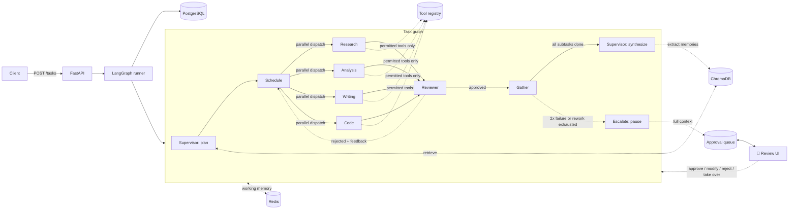

# Agent Orchestration System

> Multi-agent orchestration with tool use, persistent memory, and human-in-the-loop escalation — built as production infrastructure for autonomous AI workflows, not a chatbot demo.

A supervisor agent decomposes a complex request into a dependency-ordered plan, delegates each subtask to a specialized tool-using agent, and routes every deliverable through an independent reviewer before it's accepted. The system remembers: agents share task-scoped working memory while they run, and every completed task is distilled into long-term semantic memory that informs the next plan. And it knows when to stop: low plan confidence, repeated specialist failures, failing reviews, sensitive operations, or an explicit request pause the run mid-graph and hand the decision to a human, who can approve, edit, reject, or take over before execution resumes from the exact point it stopped. Nothing is a black box: every run produces a browsable trace tree with per-decision prompts, latencies, and dollar costs — and any past execution can be replayed deterministically or forked at a chosen step to see how it would have gone differently.

## Contents

- [How it works](#how-it-works)
- [Agent hierarchy](#agent-hierarchy)
- [Tool registry](#tool-registry)
- [Memory](#memory)
- [Human-in-the-loop](#human-in-the-loop)
- [Observability](#observability)
- [Tech stack](#tech-stack)
- [Project status](#project-status)
- [Getting started](#getting-started)
- [Usage](#usage)
- [Testing](#testing)
- [Repository structure](#repository-structure)
- [Design decisions](#design-decisions)

## How it works



1. **Intake** — a request comes in via `POST /tasks`; a task row is created and the graph runs (inline in-process today, Celery-backed in the full deployment).
2. **Plan** — the supervisor first retrieves similar past episodes, domain facts, and user preferences from long-term memory and plans with them in context. It decomposes the request into subtasks with dependencies, assigns each to a specialist, and reports a confidence score. Plans are schema-validated (unique ids, resolvable dependencies, no cycles) and retried once if invalid.
3. **Schedule & execute** — independent subtasks run in parallel; each specialist works through a bounded tool-use loop, calling only the tools it owns. Outputs, intermediate results, and errors land in shared working memory as they happen.
4. **Review** — every deliverable is scored 1–5 by a reviewer running on a *different model provider* than the specialist that produced it, so a shared provider blind spot can't rubber-stamp its own output. Rejections go back to the specialist with feedback (up to 2 rework cycles).
5. **Escalate or synthesize** — low plan confidence, two failures on the same subtask, exhausted rework, a sensitive tool call, or a user-requested review pauses the run: the graph checkpoints, the full decision context lands in the approval queue, and the reviewer is notified. Execution resumes from the exact pause point with the human's decision. Otherwise the supervisor synthesizes the final deliverable from the completed subtasks.
6. **Remember** — the finished task is distilled (what was asked, what approach worked, tools used, facts discovered, preferences observed) into long-term memory, and the task's working memory is cleared. This is how the system gets better at repeated kinds of work.

## Agent hierarchy

| Agent | Role | Model |
|---|---|---|
| **Supervisor** | Decomposes the request into a plan; synthesizes the final deliverable | Strong model (`gpt-4o`) |
| **Research** | Web research, source gathering | Cheaper model (`gpt-4o-mini`) |
| **Analysis** | Data extraction and computation (SQL + code) | Cheaper model (`gpt-4o-mini`) |
| **Writing** | Drafts, summaries, memos | Cheaper model (`gpt-4o-mini`) |
| **Code** | Writes and runs code in the sandbox | Cheaper model (`gpt-4o-mini`) |
| **Reviewer** | Scores specialist output 1–5 with feedback before it returns to the supervisor | Different provider than the producer (`claude-sonnet-5` by default) |

Every agent is a typed LangGraph node — Pydantic models in, Pydantic models out — routed through a single provider-agnostic LLM client so swapping models is a config change, not a rewrite.

## Tool registry

| Tool | Purpose | Owners | Notes |
|---|---|---|---|
| `web_search` | Web search | research | Tavily if configured, DuckDuckGo fallback otherwise |
| `file_read` / `file_write` | Read/write within the task's workspace | analysis, writing, code | Path traversal outside the workspace is rejected |
| `code_exec` | Run a Python snippet | analysis, code | Sandboxed: no network, capped CPU/memory/pids/time |
| `db_query` | Read-only SQL | analysis | `SELECT`/`WITH` only, single statement, read-only transaction |
| `api_call` | Call an allowlisted HTTP API | research | `POST` is flagged sensitive |

Every tool call — successful, rejected, rate-limited, or failed — is logged with its arguments, output, latency, and status. Each tool has a per-task rate limit, and specialists can only invoke tools they're explicitly assigned.

## Memory

**Working memory (Redis)** is scoped to a single task: the current plan, each completed subtask's output, intermediate results, and an error log, shared by every agent working the task. It's cleared on completion and TTL-guarded against crashed runs.

**Long-term memory (ChromaDB)** persists across tasks in three collections — *episodes* (what was asked and which approach worked), *facts* (domain knowledge discovered), and *preferences* (what this user likes). After every completed task an extraction pass writes new memories; before every plan, the top matches are retrieved and injected into the supervisor's prompt, with each retrieved id recorded to an audit log.

Memories carry an importance score — `(1 + access_count) × exponential recency decay` — so what gets used stays relevant:

| Mechanism | What it does | When |
|---|---|---|
| Access bump | Retrieval increments access count and re-scores importance | Every planning retrieval |
| Consolidation | Clusters near-duplicates (cosine similarity) and merges each cluster into one LLM-written summary | Daily beat job / `POST /memory/maintenance/consolidate` |
| Expiration | Deletes memories that are both stale and below the importance floor | Daily beat job / `POST /memory/maintenance/expire` |
| Dashboard | Everything the system remembers about a user, plus recent memory activity | `GET /memory/users/{id}` |
| Right to forget | Purges a user's long-term memories, working memory, and audit trail | `DELETE /memory/users/{id}` |

## Human-in-the-loop

Escalation is a first-class graph state, not an afterthought. Five triggers pause a run; each maps to an approval level that says how deep the review goes (configurable per trigger via `APPROVAL_LEVEL_OVERRIDES`):

| Trigger | Default level | The human decides on |
|---|---|---|
| Plan confidence below threshold | Approve plan | The full execution plan, before any work starts |
| User requested review | Approve plan (+ final deliverable) | The plan, and later the finished deliverable |
| Sensitive tool call (e.g. `api_call` POST) | Approve action | That specific call, arguments included |
| Specialist failed twice on a subtask | Approve action | Retry, or take the subtask over |
| Review score still failing after rework | Approve action | Retry with new guidance, reject, or take over |

`NOTIFY` is the fourth level: record it, tell the human, keep going — nothing blocks.

**Pausing is durable.** An escalation packages the complete decision context — request, plan, completed steps, the step in question, the agent's proposed action and reasoning, plus relevant long-term memories — into a Postgres-backed approval queue, notifies the reviewer (log + optional Slack-compatible webhook), and interrupts the graph. The checkpointed run survives restarts; nothing executes while a decision is pending.

**Resolution resumes the graph** exactly where it stopped, with four actions: **approve** (proceed as proposed), **modify** (edited plan / tool arguments / feedback / deliverable — validated before it's accepted), **reject** (task ends with the reason recorded), **take over** (the human's output is used; agents stand down). Human review time is recorded per approval.

**Review UI** (`make review-ui`, port 8511): the pending queue with trigger/level badges, execution progress, the proposed action with reasoning, relevant memories and similar past decisions, all four resolution actions — and a chat panel that answers clarifying questions grounded in the paused task's checkpointed state before you decide.

## Observability

**Every decision is a span.** Planning, each specialist step, every tool call, every reviewer evaluation, memory retrievals and extractions, and escalations (with the trigger, level, and the human's eventual resolution) become OpenTelemetry spans with custom attributes — exported by a custom `SpanExporter` straight into Postgres, so the trace explorer queries SQL and no collector service is needed. Full LLM prompts and responses are stored per call, referenced by span id.

**Trace explorer** (`make trace-ui`, port 8512):

| Tab | What it shows |
|---|---|
| 🌳 Trace | The span tree, color-coded 🟢🟡🔴🟠 by status, with per-node latency and cost; selecting an LLM span expands the exact prompt and response |
| 💰 Costs | Per task: dollars and tokens by agent/model, tool calls, wall-clock, human review time. Across tasks: cost per task type, most expensive agents, tool usage patterns, escalation-rate trend |
| ⏪ Replay | Recorded steps, one-click deterministic replay, fork-from-any-step with an edited response, and a side-by-side original-vs-fork diff |

**Replay is real debugging, not a viewer.** A strict replay re-executes the whole graph serving recorded LLM responses — there is no fallback client in that mode, so reproducing a run is provably zero API calls and zero cost. A *fork* replays everything before step k, substitutes your edited response at k, and runs live from there; the comparison view aligns steps by agent + prompt (immune to parallel-branch timing) and marks exactly where execution diverged.

```bash
curl localhost:8080/traces/<task_id>            # span tree + full llm calls
curl localhost:8080/traces/<task_id>/costs      # tokens, tools, wall clock, dollars
curl localhost:8080/traces/aggregates/costs     # the four cross-task rollups
curl -X POST localhost:8080/replay/<task_id> -H "Content-Type: application/json" \
  -d '{}'                                       # deterministic replay (zero API calls)
curl localhost:8080/replay/<fork_id>/compare    # where did it diverge?
```

## Tech stack

| Layer | Technology | Status |
|---|---|---|
| Language | Python 3.11+ | ✅ |
| Orchestration | LangGraph — parallel dispatch, conditional edges, Postgres checkpointer | ✅ |
| LLM providers | OpenAI + Anthropic, cross-provider reviewer routing | ✅ |
| Tool framework | Custom registry — permissions, rate limits, invocation logging | ✅ |
| API | FastAPI | ✅ |
| Persistent state | PostgreSQL — tasks, plans, subtasks, tool invocations, memory audit | ✅ |
| Short-term memory | Redis — task-scoped working memory | ✅ |
| Long-term memory | ChromaDB — episodes/facts/preferences with importance scoring | ✅ |
| Async execution | Celery + Redis — worker wired, beat schedules memory maintenance | 🚧 exercised in the full deployment |
| Human-in-the-loop | LangGraph interrupts + approval queue, four resolution actions, review UI (Streamlit) | ✅ |
| Observability | OpenTelemetry → Postgres exporter, trace explorer, cost tracking, replay/fork | ✅ |
| Observability | OpenTelemetry + trace explorer | ⬜ planned |
| Containerization | Docker + docker-compose | 🚧 infra services today; full stack later |

## Project status

| Phase | Scope | Status |
|---|---|---|
| 0 | Project scaffolding, config, infra containers | ✅ Done |
| 1 | Agent hierarchy, task decomposition, tool registry, LangGraph state machine | ✅ Done |
| 2 | Working memory (Redis) + long-term semantic memory (ChromaDB) with retrieval, consolidation, expiration | ✅ Done |
| 3 | Human-in-the-loop: escalation triggers, approval queue on graph interrupts, review UI | ✅ Done |
| 4 | Execution tracing, trace explorer, cost tracking, replay/fork/compare | ✅ Done |
| 5 | Full containerized stack, demo scenario, end-to-end tests | ⬜ Planned |
| 6 | Portfolio polish — recorded demo, final narrative | ⬜ Planned |

## Getting started

**Prerequisites:** Docker, Python 3.11+, [uv](https://docs.astral.sh/uv/), an OpenAI API key and an Anthropic API key (optional if you only run with `MOCK_LLM=1`).

```bash
git clone <this-repo> && cd agent-orchestration-system
cp .env.example .env              # fill in API keys, or leave MOCK_LLM=1 for a keyless run

uv venv --python 3.12 .venv
uv pip install -e ".[dev]"

make infra                        # postgres, redis, chromadb (docker compose)
make migrate                      # apply schema
make seed                         # seed the demo schema used by db_query
make sandbox                      # build the code-exec sandbox image

make dev                          # FastAPI on :8080, inline run mode
make review-ui                    # human review queue on :8511
make trace-ui                     # trace explorer (spans, costs, replay) on :8512
```

## Usage

```bash
curl -X POST localhost:8080/tasks \
  -H "Content-Type: application/json" \
  -d '{"request": "Compare open-source vector databases and write a recommendation memo."}'
# {"task_id": "a1b2c3...", "status": "pending"}

curl localhost:8080/tasks/a1b2c3...
# {
#   "status": "completed",
#   "plan": { "subtasks": [...], "confidence": 0.9 },
#   "subtasks": [{ "sid": "s1", "status": "completed", "review_score": 5, ... }],
#   "final_output": "..."
# }

curl localhost:8080/memory/users/default          # what the system remembers
curl -X DELETE localhost:8080/memory/users/default  # forget everything about a user

curl "localhost:8080/approvals?status=pending"      # what's waiting for a human
curl -X POST localhost:8080/approvals/<id>/resolve \
  -H "Content-Type: application/json" \
  -d '{"action": "approve", "notes": "cleared to run"}'   # …and the task resumes
```

## Testing

```bash
make test              # unit + integration, MOCK_LLM=1 — deterministic, no API keys, no cost
pytest -m live          # optional: one real round-trip against OpenAI, needs a key
```

Integration tests exercise the full stack — API → graph → Postgres — using recorded LLM fixtures (`tests/fixtures/llm/`) instead of live calls, so the same suite that runs in CI also runs offline.

## Repository structure

```
src/orchestrator/
├── config.py              # settings (env-driven)
├── main.py                # FastAPI app
├── api/routes/             # tasks.py, memory.py, approvals.py
├── llm/                    # provider routing, structured-output parsing, mock fixture player
├── agents/                 # supervisor, reviewer, specialists (research/analysis/writing/code)
├── planning/                # ExecutionPlan/Subtask schemas + decomposition
├── graph/                  # LangGraph state, nodes, conditional edges, checkpointing
├── tools/                  # tool registry + the 5 built-in tools
├── memory/                 # working (Redis), long-term (ChromaDB), extraction, retrieval, management
├── hitl/                   # escalation triggers, approval levels, queue, notifications
├── observability/          # tracing (OTel → Postgres exporter), cost tracking, replay
├── db/                     # SQLAlchemy models, Alembic migrations, repositories
└── workers/                # Celery app, task wrapper, beat jobs (memory maintenance)

ui/
├── review_app.py           # Streamlit human review queue (port 8511)
└── trace_explorer.py       # Streamlit trace/cost/replay explorer (port 8512)

tests/
├── unit/                   # schemas, registry, tools, graph routing, memory, triggers, spans, pricing
├── integration/            # API → graph → Postgres/Redis/ChromaDB, pause/resume, traces, replay
└── fixtures/llm/           # recorded LLM responses for deterministic runs
```

Remaining phases: the fully containerized 7-service stack with a scripted demo scenario, then portfolio polish (see [Project status](#project-status)).

## Design decisions

- **Reviewer on a different provider than the producer.** If the same model both writes and grades an answer, systematic blind spots go uncaught. The router forces the reviewer onto the other configured provider.
- **Plans are validated, not trusted.** Subtask ids, dependency resolution, and cycle detection (topological sort via Kahn's algorithm) are checked before a plan is scheduled; an invalid plan gets one retry with the validation error fed back to the model, then fails the task rather than executing a broken graph.
- **Sandboxed code execution.** `code_exec` runs in a container with no network access and capped CPU/memory/pids/time — a specialist can compute, not exfiltrate or DoS the host.
- **Postgres checkpointer from day one.** Human-in-the-loop (Phase 3) needs to pause a running graph and resume it later; building on LangGraph's checkpointer now avoids a state-management rewrite when that lands.
- **A mock LLM client, not mocked tests.** `MOCK_LLM=1` swaps in a fixture-playback client used by the *same* code path as production, so integration tests exercise real orchestration logic deterministically, without API cost.
- **Memory never blocks a task.** Retrieval and extraction failures degrade to "plan without memories" / "skip the write" with a warning — a flaky memory store must not fail a task that otherwise succeeded.
- **Retrieval is access.** Injecting a memory into a plan bumps its access count and importance, so the memories that actually influence work are the ones that survive consolidation and expiration.
- **Client-side embeddings.** Vectors are computed in the app (OpenAI in real mode, a deterministic token-hash under `MOCK_LLM`) and handed to Chroma explicitly — retrieval stays testable offline and independent of server-side embedding config.
- **Escalation enqueues idempotently.** An interrupted LangGraph node re-executes its pre-interrupt code when it resumes, so approval creation is keyed by (task, gate) — the resume pass finds the existing row instead of enqueueing and notifying twice.
- **Humans get context, not a yes/no button.** Every approval carries the request, plan, completed steps, the exact step in question, the agent's proposed action with reasoning, and relevant memories — plus a chat panel over the checkpointed state — because a reviewer who can't see why will rubber-stamp.
- **Spans land in Postgres, not a collector.** A custom OpenTelemetry exporter writes spans to the same database everything else lives in — one query joins a decision to its tool calls, its cost, and its approval, and the deployment stays at zero extra observability services.
- **Replay is provably offline.** Strict replay constructs the client without any fallback, so "no API calls were made" is a structural guarantee, not a promise — and replayed runs are barred from long-term memory so debugging never pollutes what the system has learned.
