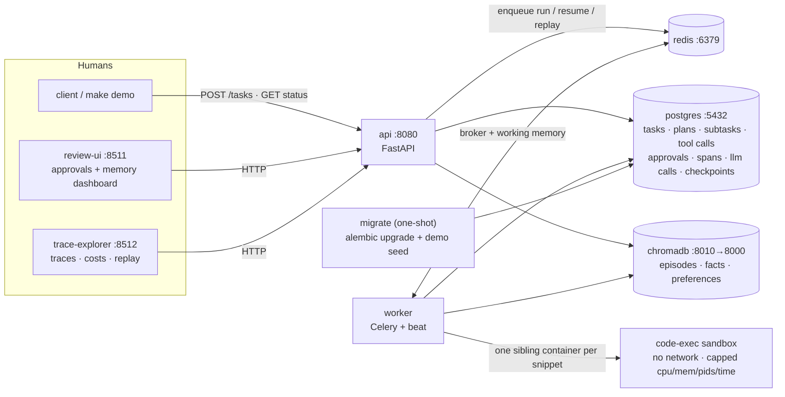
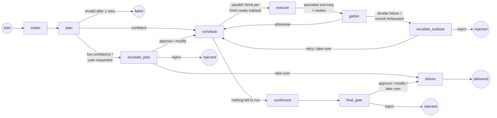

# Architecture

Design reference for the agent orchestration system: component topology, the
task graph, data flow, storage responsibilities, the reasoning behind the
design decisions, and the demo shot list. The [README](../README.md) is the
tour; this is the map.

## Contents

- [System topology](#system-topology)
- [Agent hierarchy](#agent-hierarchy)
- [The task graph](#the-task-graph)
- [Data flow](#data-flow)
- [Storage responsibilities](#storage-responsibilities)
- [Human-in-the-loop mechanics](#human-in-the-loop-mechanics)
- [Observability pipeline](#observability-pipeline)
- [Determinism and testing strategy](#determinism-and-testing-strategy)
- [Design decisions](#design-decisions)
- [Demo recording shot list](#demo-recording-shot-list)

## System topology

Seven long-running services plus two one-shot helpers, started by a single
`docker compose up`:



Startup ordering is enforced with healthchecks and `depends_on` conditions:
`migrate` waits for a healthy Postgres and gates `api` and `worker`
(`service_completed_successfully`); the `sandbox` one-shot builds the
code-execution image before the worker starts; the UIs wait for a healthy API.

Two run modes share every line of orchestration code:

- **`RUN_MODE=inline`** (development): the API executes graphs in-process —
  no worker required, instant iteration.
- **`RUN_MODE=celery`** (composed stack): the API enqueues; workers consume
  task runs, approval resumes, and replay forks from Redis. Celery beat
  schedules the nightly memory consolidation/expiration jobs.

## Agent hierarchy

| Layer | Agent | Responsibility | Default model |
|---|---|---|---|
| 1 | **Supervisor** | Retrieves memories, creates the execution plan, delegates, synthesizes the final deliverable | `openai:gpt-4o` |
| 2 | **Research** | Web research, source gathering (`web_search`, `api_call`) | `openai:gpt-4o-mini` |
| 2 | **Analysis** | Data extraction & computation (`db_query`, `code_exec`, files) | `openai:gpt-4o-mini` |
| 2 | **Writing** | Drafts, summaries, memos (files) | `openai:gpt-4o-mini` |
| 2 | **Code** | Writes and runs code (`code_exec`, files) | `openai:gpt-4o-mini` |
| 3 | **Reviewer** | Scores every specialist deliverable 1–5 with feedback | **the other provider** (`anthropic:claude-sonnet-5`) |

Routing lives in one place (`llm/router.py`): agents call
`client.complete(agent, prompt)` and never see providers. The reviewer's
route depends on the *producer's* provider — an OpenAI-produced deliverable is
reviewed by Anthropic and vice versa — so a provider-wide blind spot can't
grade its own homework. Specialists are a prompt-role plus a tool allowlist,
which is why adding a fifth specialist is a ~30-line change.

## The task graph

One LangGraph state machine (`graph/builder.py`) drives every task:



**Wave scheduling.** `schedule` computes the set of subtasks whose
dependencies are all complete and fans them out in parallel via LangGraph
`Send`. Each wave is recorded in the state (`dispatch_log`), which is how the
demo and tests assert real parallelism (`wave 1: r1, r2, r3`). Subtasks
carrying rework feedback or a failed attempt re-enter the next wave with that
context in their prompt.

**Inside `execute`.** The specialist runs a bounded tool loop (structured
JSON actions, max `MAX_TOOL_ITERATIONS`), then the reviewer scores the
deliverable. Score ≥ threshold → completed; below → `rework` with feedback
(max `MAX_SPECIALIST_RETRIES` cycles); an exception → `failed_attempt` with a
revised-approach instruction for the retry. A sensitive tool call inside the
loop pauses the whole run through the tool gate before the call executes.

**Four human gates**: `escalate_plan` (confidence / user request, before any
work), the in-loop tool gate (sensitive calls), `escalate_subtask` (double
failure / exhausted rework), and `final_gate` (user-requested deliverable
approval). All four share the same mechanics: package context → durable
approval row → `interrupt()`.

## Data flow

1. **Intake** — `POST /tasks` writes the task row and dispatches the run
   (Celery task or inline).
2. **Memory retrieval** — the supervisor queries ChromaDB (episodes, facts,
   preferences; top-k per collection, filtered by user) and injects the hits
   into the planning prompt in a labeled block; retrieved ids are recorded to
   the audit log and the trace.
3. **Planning** — structured decomposition into an `ExecutionPlan`
   (subtasks with specialist, inputs, expected format, complexity,
   `depends_on`, plan confidence). Pydantic validation enforces unique ids,
   resolvable dependencies, and acyclicity; one retry with the validation
   error in-prompt, then the task fails rather than executing a broken plan.
4. **Plan gate** — low confidence or user-requested review pauses here,
   before any agent work.
5. **Execution** — DAG waves fan out; specialists read working memory, call
   owned tools through the registry (permission + rate-limit checks, full
   I/O logging), and write results back.
6. **Review** — every deliverable is scored by the cross-provider reviewer;
   rejections loop back with feedback.
7. **Synthesis & delivery** — the supervisor composes the final output from
   completed subtasks; the optional final gate runs; the task completes.
8. **Memory write-back** — an extraction pass distills the episode, facts,
   and preferences into ChromaDB; the task's working memory is cleared.
9. **Throughout** — every step emits spans (see
   [Observability pipeline](#observability-pipeline)).

## Storage responsibilities

| Store | Holds | Why this store |
|---|---|---|
| **Redis** | Task-scoped working memory (plan, subtask outputs, intermediates, error log, TTL-guarded); Celery broker/results; tool rate-limit counters | Shared scratch space needs speed and TTLs, not durability |
| **PostgreSQL** | Tasks, plans, subtasks, tool invocations, approvals, spans, LLM calls (full prompts/responses), LangGraph checkpoints, memory audit log, seeded `demo` schema for `db_query` | Everything that must survive a restart or be queried relationally |
| **ChromaDB** | Long-term semantic memory in three collections with importance/recency/access metadata | Similarity retrieval is the access pattern; metadata drives consolidation and expiration |

## Human-in-the-loop mechanics

**Triggers → levels** (defaults, overridable per trigger):

| Trigger | Level |
|---|---|
| `low_plan_confidence` | approve_plan |
| `user_requested` | approve_plan (+ final-deliverable approval) |
| `sensitive_operation` | approve_action |
| `specialist_double_failure` | approve_action (take-over offered) |
| `low_review_score` | approve_action |

Triggers are pure predicates over plain values (`hitl/triggers.py`) — no I/O,
no settings access — so every rule is unit-testable in isolation.

**Pause.** A gate packages the full decision context (request, plan,
completed steps, current step, proposed action, agent reasoning, relevant
memories), writes an approval row, notifies (log + optional Slack-compatible
webhook), and calls LangGraph `interrupt()`. The run's state checkpoints to
Postgres; nothing executes while pending, and the pause survives restarts.

**Idempotency.** An interrupted node re-executes its pre-interrupt code on
resume, so approval creation is keyed by `(task_id, gate_key)` — the resume
pass finds the existing row instead of enqueueing (and notifying) twice.

**Resume.** `POST /approvals/{id}/resolve` validates the human payload
(a modified plan must re-validate; a take-over must carry output), then
resumes the graph with the decision merged into state: approve proceeds,
modify substitutes the edited plan/arguments/feedback/deliverable, reject
terminates with the recorded reason, take over uses the human's output and
stands the agents down. Review time is recorded per approval and rolls into
the cost report.

**The chat panel** answers clarifying questions from the checkpointed state,
the approval's context package, and the task's working memory — grounded, not
free-associating — so the reviewer can interrogate a paused run before
deciding.

## Observability pipeline

```
agent / tool / memory / gate code
  └─ OpenTelemetry spans (custom attributes: agent, model, sid, tokens, cost, status, …)
       └─ custom SpanExporter → Postgres `spans` table
            ├─ `llm_calls` table: full prompt + response per call, FK to span
            ├─ trace explorer (Streamlit) reads via /traces API
            └─ cost report joins llm_calls × static price table + tool invocations
                                        + approval review times
```

Choosing Postgres over a collector+Jaeger pair keeps the deployment at zero
extra services and — more importantly — makes traces *joinable*: one SQL query
links a decision span to its exact prompt, its tool calls, its dollar cost,
and the approval it triggered.

**Cost model.** Provider usage counts × a static per-MTok price table
(`llm/pricing.py`). Mock fixtures carry realistic token counts so the cost
tooling is demonstrable in keyless runs; `replay:` calls price at zero.
Aggregates: cost per task type (the plan's specialist mix), most expensive
agents, tool usage patterns, escalation-rate trend.

**Replay.** Every LLM and tool call is recorded with full I/O, so a past run
can be re-executed with a playback client that has *no fallback* — zero API
calls is structural. Fork mode substitutes an edited response at step k and
runs live from there; the comparison aligns original and fork by
(agent, prompt) rather than sequence position, so parallel-branch timing
doesn't produce false divergences.

## Determinism and testing strategy

- `MOCK_LLM=1` swaps the provider client for a fixture player behind the same
  interface; fixtures are matched exact-first (sha of agent+prompt), then by
  in-prompt substring markers, then per-agent defaults.
- Fixtures are captured from live runs by `scripts/record_fixtures.py`, which
  wraps the real client in a recorder and auto-approves any gate.
- External-effect tools (`web_search`, `api_call`) are mocked at the tool
  boundary; `db_query` and `code_exec` run for real against the seeded schema
  and the sandbox.
- Test pyramid: unit (pure logic — triggers, schemas, pricing, importance),
  integration (API → graph → real Postgres/Redis/Chroma), e2e (the six
  system-level scenarios + full lifecycle). One `-m live` smoke test hits a
  real provider when keys are present.
- The fixtures ship in the api/worker images, so the *composed* stack runs the
  full demo key-free through the production code path.

## Design decisions

1. **Cross-provider review.** Same-model self-review rubber-stamps systematic
   errors; routing the reviewer to the other provider makes the quality gate
   an independent measurement. Cost: a second provider dependency —
   worthwhile because the reviewer is the only agent whose judgment gates
   everything else.
2. **Validated plans over trusted plans.** Structured output is parsed into
   Pydantic models with cycle detection (Kahn's algorithm) before anything
   runs; one retry with the validation error in-prompt, then fail fast. A
   malformed plan should be a clean failure, not a half-executed graph.
3. **Interrupt + checkpoint as the HITL primitive.** Pausing is the hard part
   of human-in-the-loop; LangGraph's interrupt/checkpointer gives durable,
   resumable pauses at any node, so approvals are graph states rather than
   application-level polling hacks.
4. **Spans in Postgres.** Traces are most valuable when they join against
   business rows (costs, approvals, tool logs). A collector stack would add
   services and put traces in a silo.
5. **A mock client, not mocked tests.** The fixture player sits behind the
   production interface, so deterministic tests still execute real routing,
   parsing, graph edges, and persistence — the things that actually break.
6. **Memory degrades, never blocks.** Retrieval/extraction failures log a
   warning and continue; a flaky vector store must not fail a task that
   otherwise succeeded.
7. **Importance = f(access, recency).** Retrieval bumps access counts, so the
   memories that inform plans are exactly the ones consolidation keeps and
   expiration spares — usage is the relevance signal.
8. **Sandbox as sibling containers.** `code_exec` snippets run in a dedicated
   minimal image with no network and capped cpu/mem/pids/wall-time. In the
   composed stack the worker launches siblings through the host socket —
   simple and effective for a single trusted host; a rootless runtime is the
   hardening path.
9. **Sensitive-by-flag, gated in the loop.** Tools declare sensitivity
   (e.g. `api_call` POST); the gate fires *before* the call executes, inside
   the specialist's loop, with the exact arguments in the approval — humans
   approve actions, not intentions.
10. **Everything keyless-runnable.** From a clean checkout with no API keys:
    the full stack, the demo, and all 129 deterministic tests. Reviewability
    of a portfolio system is a feature.

## Demo recording shot list

Target: under 5 minutes, against the composed stack (`MOCK_LLM=1` is fine —
the flow is identical; real keys just make the prompts live).

| # | ~Time | Shot | What to show |
|---|---|---|---|
| 1 | 0:00–0:20 | Terminal | `docker compose ps` — 7 healthy services; one sentence on the architecture over the README hero diagram |
| 2 | 0:20–0:45 | Terminal | `make demo` — warm-up task completes and seeds memory ("long-term memory now holds N records") |
| 3 | 0:45–1:10 | Terminal | Showcase task submitted; plan gate prints trigger/level and plan confidence 0.88; script auto-approves the plan gate |
| 4 | 1:10–1:50 | Trace explorer :8512 | The running/finished task's tree: wave 1 `execute:r1/r2/r3` in parallel with `web_search` tool spans; expand one LLM span to its prompt/response |
| 5 | 1:50–2:20 | Trace explorer | `review:w1` score 2 (yellow) with "Missing citations…" feedback → the second `execute:w1` wave → score 5. The rejection→rework loop in one picture |
| 6 | 2:20–3:10 | Review UI :8511 | The final-memo approval: trigger badge, execution progress, proposed deliverable with reasoning, relevant memories; ask the chat panel "What sources does the memo cite?"; click **Approve** |
| 7 | 3:10–3:35 | Terminal | Demo epilogue: the memo, waves, reviewer verdicts, memory retrieval/write-back counts, escalations with human review time, `cost: $…` |
| 8 | 3:35–4:05 | Review UI → 🧠 Memory dashboard | Episodes/facts/preferences with importance & access counts — the lessons just learned; mention consolidation/expiration and the right-to-forget button |
| 9 | 4:05–4:45 | Trace explorer | 💰 Costs tab (per-agent cost, the four aggregate rollups), then ⏪ Replay: replay the demo task deterministically, show the fork-at-step control |
| 10 | 4:45–5:00 | README | Hero diagram + closing framing line: production infrastructure for autonomous AI workflows |
